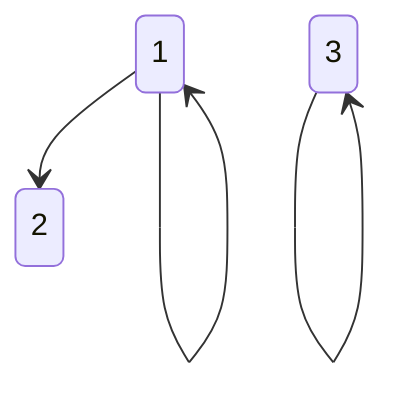
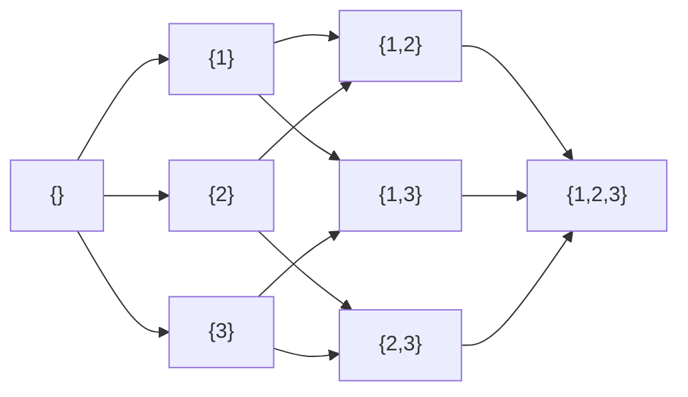
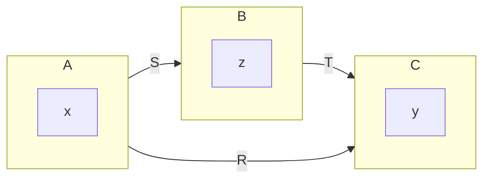
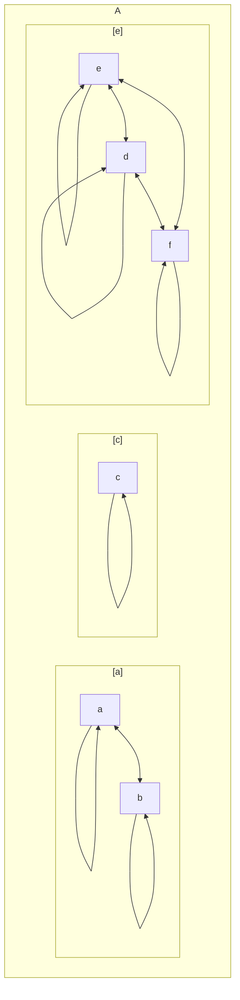

# Definición

Definimos $R$ como una relación en $A$ si $R \subseteq A\times A$, utilizando el producto cartesiano. Por ejemplo, sea $A = \{1, 2, 3\}$. Podremos definir una relación $R_1 = \{(1,1), (1,2), (3,3)\}$.

Existen dos formas para denotar que un par de elemento pertenece a una relación.

$$
(1, 2) \in R_1
$$

$$
1R_1 2
$$

Para representar una relación, también podremos utilizar una matriz de adyacencia, con la cantidad de elementos de $A$ como tamaño.

$$
A_{R_1} = \begin{pmatrix}
1 & 1 & 0 \\
0 & 0 & 0 \\
0 & 0 & 1
\end{pmatrix}
$$

Otra forma de representar la relación es graficando el conjunto y señalando con flechas las relaciones entre los objetos.

La flecha parte del primer elemento del par, y llega al segundo elemento del par.

Cuando una relación es reflexiva, antisimétrica y transitiva, se llama relación de orden.

El conjunto donde se ha introducido esa relación se llama conjunto ordenado.

1. Reflexiva: $\forall a \in A: aRa$
2. Antisimétrica: $\forall a,b \in A: (aRb, bRa) \to a=b$
3. Transitiva: $\forall a,b,c \in A: (aRb, bRc) \to aRc$

Se dice que $(a, R)$ es un conjunto parcialmente ordenado, o es POSET. De ahora en más, se utilizara el símbolo $\leq$ para representar una relación de orden. $aRb = a ≤ b$

Se dice orden parcial ya que no todos los elementos están en relación entre sí. La relación sólo está presente para un subconjunto de los elementos. $a \nleq b$ no implica $a \geq b$.

## Diagrama de Hasse

Sea $A = \{1,2,3\}$, en $P(a)$ (todos los subconjuntos de $A$) se define la relación de orden $\subseteq$.

El diagrama de ***Hasse*** ordena los elementos de un conjunto de forma ascendente. uniendolos con una arista si son sucesores inmediatos. 

# Relación Inversa

Definimos $R^{-1}$ como el conjunto de las relaciones de $R$ invertidas. Entonces:

$$
R^{-1} = \{(x,y) \in A^2 : yRx\}
$$

$$
xRy \iff yR^{-1}x
$$

El opuesto de $R$, define aquellas relaciones que no pertenecen a $R$. Podemos definirla como:

$$
R' = A^2 - R
$$

Analizando las representaciones matriciales, tendremos

$$
A_{R'} = J - A_R
$$

$$
A_R^T = A_{R^{-1}}
$$

# Composición de Relación

Sean $S, T$ dos relaciones del conjunto $A$. Entonces definiremos la relación  $R = S \circ T$ para la cual:

$$
xRy \iff \exists z: xSz, zTy
$$

# Propiedades de Relación

En una relación, se pueden presentar las siguientes propiedades independientes, siendo $R$ una relación en el conjunto $A$.

- **Reflexiva:** $\forall x \in A: xRx$
- **Irreflexiva:** $\forall x \in A: xR'x$
- **Simétrica: $\forall x,y \in A: xRy \iff yRx$**
- ***Anti simétrica:*** $\forall x,y \in A: (xRy, yRx) \implies x =y$
- ***Asimétrica:*** $\forall x,y \in A: xRy \implies yR'x$
- ***Transitiva: $\forall x,y,z \in A: (xRy, yRz) \implies xRz$**
- ***Anti transitiva: $\forall x,y,z \in A: (xRy, yRz) \implies xR'z$**

## Transitividad

Sean $S,T$ relaciones en $A$, entonces si definamos $R = S \circ T$, hallamos que, con el producto matricial binario:

$$
A_SA_B = A_R
$$

Para demostrarlo, utilizaremos la definición del producto matricial binario.

$$
A_SA_T(i,j) = 1\xLeftrightarrow{\text{ def. del producto}} \\ \sum_{k=1}^n A_S(i,k) A_T(k,j)  = 0 \xLeftrightarrow{\text{ por ser binario}} \\
\exists k: A_S(i,k) = 1 \wedge A_T(k,j) = 1 \xLeftrightarrow{\text{ definición de forma matricial}}  \\
\exists k:a_iSa_k \wedge a_kTa_j \xLeftrightarrow{\text{ definición de composición}} \\
a_i R a_j \xLeftrightarrow{\text{ definicion de forma matricial}} \\  A_R(i,j) = 1
$$

Por definición, $R \circ R$ es transitiva, entonces $R$ es transitiva si y sólo si $R \circ R \subset R$. Otra forma de expresarlo sería $A^2_R \leq A_R$.

## Operaciones en Matrices

Sean $A,B \in \mathbb{R}^{n\times m}$ entonces:

- **Orden:** $A \leq B \iff A(i,j) \leq B(i,j), \forall i,j$
- ***Producto Hadamard:*** $(A \odot B)(i,j) = A(i,j)B(i,j), \forall i,j$

# Clausuras

Sea $P$ una propiedad de relación $R$, entonces sea $S$ una relación particular, la $P\text{-clausura}$ de $S$ es otra relación $H \supset S$ que tiene la propiedad $P$ y es minimal respecto a todas las que contienen a $S$.

Puede generarse la clausura añadiendo uno a uno las relaciones necesarias, recalculando en cada paso.

# Relaciones de equivalencia

Una relación de equivalencia es una relación que cumple simultáneamente las propiedades: reflexiva, simétrica y transitiva.

Podemos ver que al introducir una relación de equivalencia en un conjunto, formaremos pequeños *clusters* aislados en el conjunto de modo que cualquier elemento de un cluster está en relación todos los elementos del mismo cluster , y con ningún elemento fuera del cluster

> [!note]
> ***Definición 1:  Sea*** $a \in A$, La clase de $a$ se denomina $[a] = \{x \in A: aRx\}$. Normalmente, se elige un representante de cada clase

> [!note]
> Las clases no son vacías, esto es inmediato debido a la reflexividad.

> [!note]
> Dos clases distintas son disjuntas, si un elemento pertenece a más de una clase, entonces debido a la transitividad y la reflexividad estas clases se juntarían.

> [!note]
> La relación de equivalencia introduce una partición de clases, coloquialmente conocida como partición. Todos los elementos están en por lo menos una clase y las clases son disjuntas.

> [!note]
> ***Definición 2:*** Definimos $A/R$ como el conjunto de clases de $A$ bajo la relación de equivalencia de $R$. $A/R = \{[a]: a \in A\}$
